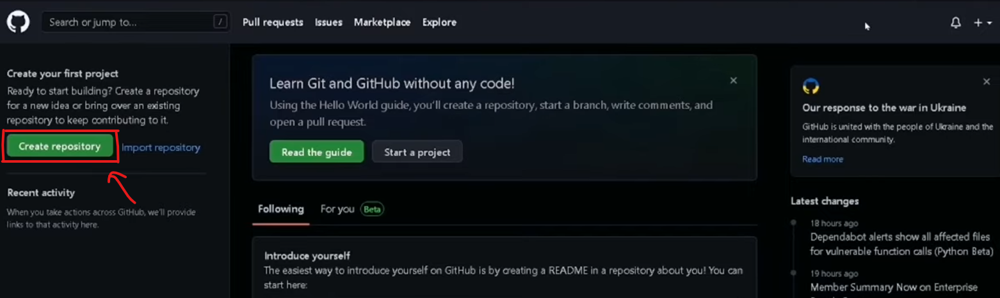
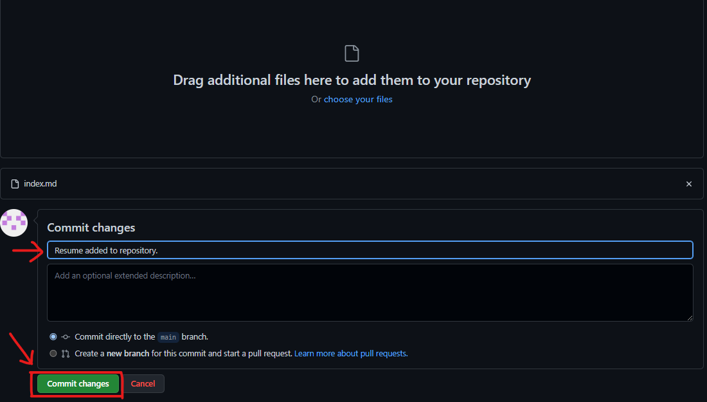
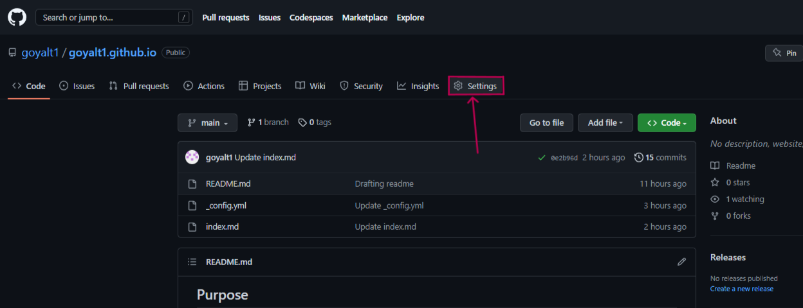
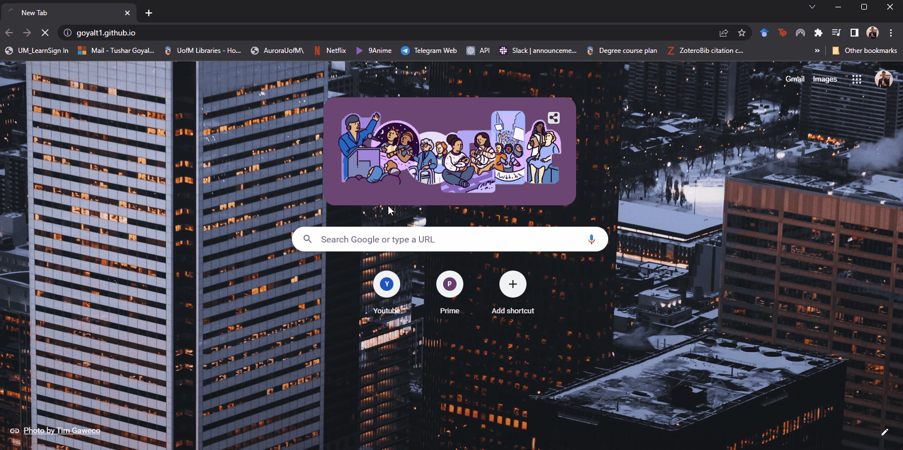

## Purpose 

This readme will guide you on how to host your resume on static site. We will be using GitHub Pages, a static website hosting service by GitHub. 
> There are a lot of technical documentation tools available out there.  
Readers interested in knowing more about technical writing tools and process can refer to [Technical Writing (Etter's Principles)](#technical-writing-(etter's-principles)). This section refers to Andrew Etter's principles from Modern Technical Writing and how this document makes use of the same.

## Pre-requisites
Windows 11 64x operating system was used for this instance.  
* Resume
* Markdown
* GitHub account

## Instructions

Markdown is one of the famous markup languages. It can be written using any text editor and is saved in a file with `.md` extension. The resume hosted is also written in markdown. I used Visual Studio (VS) Code to write my resume in markdown.

 >If you are new to markdown, here is a [tutorial for learning markdown syntax](md-tut).  


### Step 1: Install and Setup VS Code for Markdown.
There are a lot of markdown editors available out there. You can use any of them to your liking. I am providing instructions for using markdown in VS Code.
1. Download and install VS Code from Microsoft store or from the [website](https://code.visualstudio.com/download).
2. Add/install the [Markdown Preview Github Styling](https://marketplace.visualstudio.com/items?itemName=bierner.markdown-preview-github-styles) extension.  
This gives you a preview of your markdown document you are working on.  
3. Create a file named `index.md`. The resume will be saved in this file.  
*Resume should be saved in **index.md***.
4. You can now write your resume in markdown format.

>Make sure to have your resume ready in markdown file named *index.md* before moving onto next steps.

### Step 2: Create Account on GitHub.
GitHub is a distributed version control software and is a very useful tool. You can also upload and save your projects on it.
1. Go to [GitHub website](https://github.com/) and enter your email to sign up for an account.
2. Create a password and username.
3. Select "Just me" and choose the relevant option for student/teacher.
4. Select collaborative coding, automation and CI/CD, client apps, project management and community.
5. Select the free account.

### Step 3: Create a Repository on GitHub.
Your account must have been created if you are here. Let's make our first repository on our new gitHub account.
1. Click create repository button as shown in the image.

2. Enter the name of the repository as `your_github_username.github.io`.
3. Select *public* for repository type.
4. Select *Add a README file*. This step is optional.  
5. Click create repository button.
You have created a GitHub repository. 

### Step 4: Upload And Commit Files on GitHub.
At this point we have a resume saved as *index.md* and a repository. We will upload these files to our repository.
1. Click *Add file* and select upload files.
2. Select *index.md*. Add a custom commit message and click commit changes (See the image below).

We have saved files to our repository. The same can be done using command line, but, it is not required.

### Step 5: Setup Configuration for GitHub Pages.
We will add a configuration file with name *_config.yml*. This file will have the theme and layout for the hosted resume.
1. Click *Add file* again and select *Create new file*.
2. Name the file `_config.yml`.
3. Copy and paste the following in the file.

    ```ruby
    remote_theme: pages-themes/midnight@v0.2.0
    plugins:
    - jekyll-remote-theme # add this line to the plugins list if you already have one

    title: [RESUME]
    ```
    > You can use a different jekyll remote theme or default *minima* theme. I used the remote theme midnight@v0.2.0.
4. Commit and save changes.

### Step 6: Publish the site.
You now have a `index.md`, `_config.yml` and `README.md`. We are done with all the setup and configuration. The only thing left to do is publish and the GitHub Pages will build our site with Jekyll.
> Make sure you are in the repository that contains the files mentioned before.
1. Click the repository settings as shown in the image below. 
    
2. Find and click *Pages* in the side menu panel.
3. Click drop down under *Source* in the GitHub Pages menu. Select *Deploy from a branch*.
4. Git will start deploying your site. Wait for a few minutes.
5. The link for your deployed site would be displayed under GitHub Pages. Click it, congratulations!

                    This is how your hosted resume, a static site will appear. Nice!



## Technical Writing (Etter's Principles)
Andrew Etter is a credible technical writer. He published Modern Technical Writing: An Introduction to Software Documentation, to help new technical writers and people trying to get into the profession. I will discuss some of the concepts and principles from Etter's book.

1. Etter suggests the use of light markup languages such as markdown. The reason for this is, XML-based markup languages and HTML are syntax heavy and difficult to use.  
Further, lightweight markup languages give the user flexibility and are easy to convert to other formats. Using static site generating tools like Jekyll or Github Pages it is easy to host and publish websites as light markup files can be used directly.
> GitHub Pages has Jekyll support and simply builds static websites from markdown and choice of layouts.

2. One of the Etter's principle is using distributed version control systems (DVCS). We did this in our hosting resume example as well. According to Etter, DVCS promote developer contribution to the documentation process. Also, it becomes easier to collaborate and keep the documentation up-to-date with the software.

3. One of Etter's principle states how to structure the documentation and the level of detail that needs to be present in a technical writing. One should try not to put too much detail and write as per the expected audience.
> This readme does not gives details on where or how to open a website. There is use of graphics in this readme and etter also suggests it.
4. Using static websites. Static websites are easy to create and portable. The content can also be updated easily as they make use of light markup for the content.

There are lot more useful tips and concepts in Modern Techincal Writing. The link to the book can be found in More Resources for readers interested in further learning technical writing process.

## More Resources
* Markdown
    1. [helloacm.com - Tutorial](md-tut)
    2. [markdownguide.org - Markdown Cheat Sheet](https://www.markdownguide.org/cheat-sheet)
* Github  
    1. [freecodecamp.org - Tutorial for beginners](https://www.freecodecamp.org/news/git-and-github-for-beginners/#prerequisites)
    2. [github.com - Git Cheat Sheet](https://education.github.com/git-cheat-sheet-education.pdf)
* Andrew Etter's Modern Technical Writing: An Introduction to Software Documentation
    1. [Get the book](https://www.amazon.ca/Modern-Technical-Writing-Introduction-Documentation-ebook/dp/B01A2QL9SS)
    2. [Andrew Etter on Jekyll](https://www.youtube.com/watch?v=cQqRumnj1qo)


## Authors and Acknowledgement

This document and repository is created and maintained by Tushar Goyal.  
The jekyll theme used in this repository was imported from [this repository](credit).

## FAQs

* Why host resume on static website?
    > Hosting static website for a resume shows creativity and skill level of the applicant to the employer, especially in IT. Hosting your resume motivates you to keep it updated.
* Why is markdown better than a word processor?
    > Word processors are heavy applications. It is difficult to convert these files. Whereas, markdown can be easily written in any text editor. Markdown provides flexibility as can be used to create static sites and easy conversion to different formats.
* Why is my resume not showing up?
    > There are few different things to look for:  
     * Check if git finished building under actions tab. If it is queued wait for it to finish.  
     * Check if the configuration file has the exact same name as `_config.yml`.  
     * Verify the contents of the configuration file and the code provided.  
     * Check the name of your resume. It must be `index.md`.
     * If you followed the steps exactly; try again in a while as GitHub Pages might be down.

[md-tut]: https://www.markdowntutorial.com/
[credit]: https://github.com/pages-themes/midnight.git
